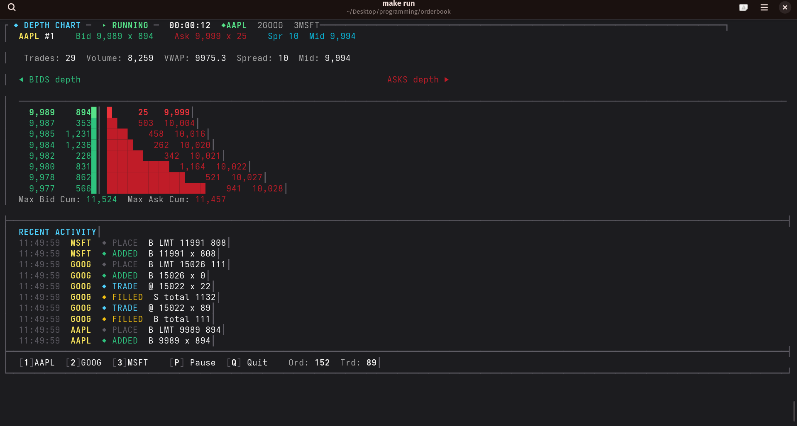

# orderbook

A real-time limit order book matching engine simulator with a terminal-based UI. Written in modern C++23.

## Features

- **Order Types**: Limit, Market, Stop-Limit, Stop-Market, Iceberg
- **Time-In-Force**: Good-Till-Cancel (GTC), Immediate-or-Cancel (IOC), Fill-or-Kill (FOK), Good-Till-Date (GTD)
- **Pricing**: Price-time priority (FIFO) matching across multiple price levels
- **Stop Orders**: Trigger logic on price crosses for both stop-limit and stop-market orders
- **Iceberg Orders**: Hidden quantity with configurable peak size and auto-refill
- **Expired Order Sweeping**: Automatic removal of past-dated GTD orders
- **Write-Ahead Log (WAL)**: Crash recovery via operation replay
- **Terminal UI**: Live depth chart, order book levels, trade log, and per-stock statistics
- **Market Data**: Trade history, VWAP, volume tracking, and book depth snapshots
- **Fuzz Testing**: Randomized order sequences for robustness validation

## Architecture

```
┌─────────────────────────────────────────┐
│              main.cpp / Simulator       │
│  (terminal UI, random order generation, │
│   WAL replay, event rendering)          │
└──────────────┬──────────────────────────┘
               │
               ▼
┌─────────────────────────────────────────┐
│           MatchingEngine                │
│  (routes orders to the correct Stock)   │
│  ┌─────────────────────────────────┐   │
│  │          Stock                  │   │
│  │  ┌─────────────────────────┐   │   │
│  │  │       OrderBook         │   │   │
│  │  │  ┌─────┐  ┌─────┐      │   │   │
│  │  │  │Bids │  │Asks │      │   │   │
│  │  │  │ >P1 │  │ <P1 │      │   │   │
│  │  │  │ >P2 │  │ <P2 │      │   │   │
│  │  │  └─────┘  └─────┘      │   │   │
│  │  └─────────────────────────┘   │   │
│  └─────────────────────────────────┘   │
└──────────────┬──────────────────────────┘
               │
    ┌──────────┴──────────┐
    ▼                     ▼
┌──────────┐      ┌──────────────┐
│   WAL    │      │ MarketData   │
│ (crash   │      │ (trade hist, │
│  recov.) │      │  VWAP, etc.) │
└──────────┘      └──────────────┘
```

### Key Components

| Component | Header | Description |
|-----------|--------|-------------|
| **Order** | `order.h` | Order entity — side, price, qty, type, iceberg/stop fields |
| **OrderBook** | `order_book.h` | Core limit order book with bid/ask maps, FIFO matching, stop/iceberg logic |
| **MatchingEngine** | `matching_engine.h` | Multi-stock engine; routes orders to per-stock books |
| **LevelInfo** | `level_info.h` | Aggregated price-level quantity snapshots |
| **Trade** | `trade.h` | Trade record with bid-side and ask-side order references |
| **Event** | `event.h` | Typed event system (add, fill, cancel, trade, stop, etc.) |
| **MarketData** | `market_data.h` | Trade history, VWAP, stats, book depth extraction |
| **WAL** | `wal.h` | Append-only write-ahead log for crash recovery |
| **Terminal** | `terminal.h` | Raw terminal I/O, ANSI rendering, helper utilities |

### Order Lifecycle

```
  PlaceOrder ──► OrderBook ──► Match? ──yes──► Trade(s) + Fill/Cancel events
                    │            no
                    ▼            │
              Book entry         ▼
              (bid/ask map)    Stop trigger check ──► Stop activated? ──► Match
                                      │
                                      ▼
                                 Stop stored
```

## Screenshot



## Requirements

- C++23 compiler (GCC 14+ or Clang 18+)
- Google Test (for running tests)
- Linux (terminal UI uses raw terminal mode)

## Build

```bash
make build
```

The output binary is `build/orderbook` and the static library is `build/liborderbook.a`.

### Release build

```bash
make release
```

Optimised with `-O3 -march=native -flto -DNDEBUG`.

## Run

```bash
make run
```

Or directly:

```bash
./build/orderbook
```

### Options

| Option | Description |
|--------|-------------|
| `--wal <path>` | WAL file path (default: `orderbook.wal`) |
| `--no-wal` | Disable write-ahead logging |
| `--help` | Show usage and exit |

### Interactive keys

| Key | Action |
|-----|--------|
| `1` / `2` / `3` | Switch stock |
| `Space` | Cycle stock |
| `P` | Pause / resume simulation |
| `R` | Restart from WAL file |
| `Q` | Quit |

## Test

```bash
make test
```

Runs unit tests via Google Test in `build/orderbook_tests`.

### Release test

```bash
make release-test
```

## Fuzz

```bash
# Build fuzz target
make build && g++ -std=c++23 -I include -DSTANDALONE_FUZZ=1 \
  fuzz/order_book_fuzz.cpp -Lbuild -lorderbook -o build/orderbook_fuzz

# Run
./build/orderbook_fuzz
```

## Clean

```bash
make clean
```
